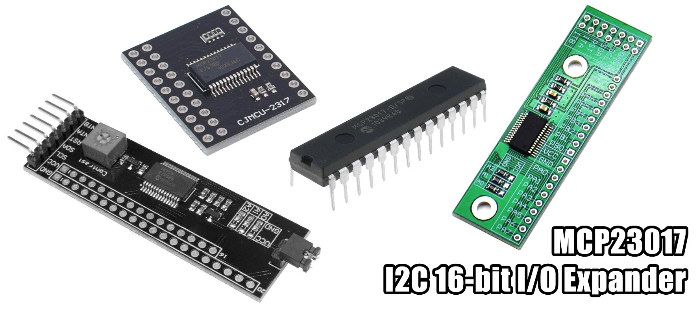

# MicroPython MCP23017 16-bit I/O Expander

A MicroPython library for the MCP23017 16-bit I/O Expander with I2C Interface.



## Examples

```python
from machine import Pin, I2C
import mcp23017
i2c = I2C(scl=Pin(22), sda=Pin(21))
mcp = mcp23017.MCP23017(i2c, 0x20)

# list interface
mcp[0].input()
mcp[1].input(pull=1)
mcp[1].value()
mcp[2].output(1)
mcp[3].output(0)

# method interface
mcp.pin(0, mode=1)
mcp.pin(1, mode=1, pull=True)
mcp.pin(1)
mcp.pin(2, mode=0, value=1)
mcp.pin(3, mode=0, value=0)

mcp.config(interrupt_polarity=0, interrupt_mirror=1)

# property interface 16-bit
mcp.mode = 0xfffe
mcp.gpio = 0x0001

# property interface 8-bit
mcp.porta.mode = 0xfe
mcp.portb.mode = 0xff
mcp.porta.gpio = 0x01
mcp.portb.gpio = 0x02
```

For more detailed examples, see [examples](/examples).

#### Pins

Pin   | Type | Description
:----:|:----:|:----------------------------------------
A0    | I    | Address select 1, connect to VCC or GND
A1    | I    | Address select 2, connect to VCC or GND
A2    | I    | Address select 3, connect to VCC or GND
INTA  | O    | Interrupt output for port A
INTB  | O    | Interrupt output for port B
RESET | I    | Reset, active LOW
GPA0  | IO   | Port A, Pin 0
GPA1  | IO   | Port A, Pin 1
GPA2  | IO   | Port A, Pin 2
GPA3  | IO   | Port A, Pin 3
GPA4  | IO   | Port A, Pin 4
GPA5  | IO   | Port A, Pin 5
GPA6  | IO   | Port A, Pin 6
GPA7  | IO   | Port A, Pin 7
GPB0  | IO   | Port B, Pin 0
GPB1  | IO   | Port B, Pin 1
GPB2  | IO   | Port B, Pin 2
GPB3  | IO   | Port B, Pin 3
GPB4  | IO   | Port B, Pin 4
GPB5  | IO   | Port B, Pin 5
GPB6  | IO   | Port B, Pin 6
GPB7  | IO   | Port B, Pin 7
VDD   | P    | Power (3V3 or 5V)
VSS   | P    | Ground
CS    | I    | Not used - SPI Chip Select (CS) on the SPI version (MCP23S17)
SCK   | I    | I2C Serial Clock - SPI Serial Clock (SCK) on the SPI version
SI    | I    | I2C Serial Data - SPI Serial Data In (MOSI) on the SPI version
SO    | O    | Not used - SPI Serial Data Out (MISO) on the SPI version

## Methods

Construct with a reference to I2C and set the device address (0x20-0x27).
If are you not sure what it is, run an `i2c.scan()`.
```python
__init__(i2c, address=0x20)
```

Initialises the device.
```python
init()
```

Configures the device by writing to the iocon register.
```python
config(interrupt_polarity=None, interrupt_open_drain=None, sda_slew=None, sequential_operation=None, interrupt_mirror=None, bank=None)
```

Method for getting, setting or configuring a single pin.
If no value is provided, the port will read the value from the GPIO register and return for the current pin.
If a value is provided, the port will write the value to the GPIO register.
Valid pin range 0-15.
All of the other optional arguments are booleans.
```python
pin(pin, mode=None, value=None, pullup=None, polarity=None, interrupt_enable=None, interrupt_compare_default=None, default_value=None)
```

Private method for toggling a bit in a value based on a condition.
```python
_flip_bit(value, condition, bit)
```

Provides the list interface for interacting with "virtual pins".
```python
__getitem__(pin)
```

## Virtual pin methods

Constructed with a specific pin (0-7) and the port it belongs to.
```python
__init__(pin, port)
```

Private method for toggling a bit in a value based on a condition.
```python
_flip_bit(value, condition):
```

Private method for getting a single bit from the given value based on the current pin
```python
_get_bit(value):
```

Reads or writes the current pins value (0-1).
```python
value(val=None):
```

Configures the pin as input and optionally configures it to be pulled up.
```python
input(pull=None):
```

Configures the pin to be output and optionally sets it's value (0-1).
```python
output(val=None):
```

## Port methods

Constructed with the port number (0-1) and a reference to the main class.
```python
__init__(port, mcp)
```

Private method for calculating which register to write to as their address
can change when configured to use different addressing scheme (iocon.bank).
```python
_which_reg(reg)
```

Private method for toggling a bit in a register based on a condition.
```python
_flip_property_bit(reg, condition, bit)
```

Private method for reading the register over I2C.
```python
_read(reg)
```

Private method for writing to the register over I2C.
```python
_write(reg, val)
```

## Properties

There are two sets of properties, one on the main class and one on each port class.

Properties on the main class wrap the properties in each port.

You can get and set on the main class properties with a 16-bit integer and it splits
it into two 8-bit integers and forwards to each port.

You can also get and set on the ports a and b directly with 8-bit integers.

The registers accessible using the property interface are:

Property                  | Register | Type | Description
------------------------- | -------- | ---- | -----------------------------------------------
mode                      | iodir    | R/W  | Direction 0=output, 1=input
input_polarity            | ipol     | R/W  | Input polarity 0=normal, 1=invert
interrupt_enable          | gpinten  | R/W  | Interrupt enable 0=disabled, 1=enabled
default_value             | defval   | R/W  | Interrupt default value
interrupt_compare_default | intcon   | R/W  | Interrupt config
io_config                 | iocon    | R/W  | IO config
pullup                    | gppu     | R/W  | Pull-up
interrupt_flag            | intf     | R    | Interrupt flag 1=this pin triggered interrupt
interrupt_captured        | intcap   | R    | Interrupt captured - state of pins at interrupt
gpio                      | gpio     | R/W  | General purpose IO
output_latch              | olat     | R/W  | Output latch - which output pins are high

Getter on the main class reads the GPIO register and returns a 16-bit integer.
The lower 8 bits represent port a.
```python
gpio
```

Getter on the nested port classes reads their GPIO registers and returns 8-bit integers.
```python
porta.gpio
portb.gpio
```

Setter on the main class writes to the both of the GPIO registers in port a and b.
The lower 8 bits represent port a.
```python
gpio = 0xffee
```

Setter on the nested port classes writes to their GPIO registers.
```python
porta.gpio = 0xee
portb.gpio = 0xff
```

You can use bitwise assignment operators to toggle specific pins, which performs a read, modify, write.

```python
# set all pins low
porta.gpio = 0
# set the first 4 pins high
porta.gpio |= 0x0f
# set the first 2 pins low
porta.gpio &= ~0x03
# invert the first 4 pins
porta.gpio ^= 0x0f
```

## Ports

Featuring a 16-bit bidirectional I/O port where each pin can be configured as active-high, active-low or open-drain.
Polarity can be inverted on any of the pins.
Work on both 3V3 or 5V logic.

* A0-A7
* B0-B7

## Interrupts

Two independent interrupts, one for each 8-bit port, which can be linked/mirrored in software so that any pin change triggers both.

Interrupt can be configured to watch any specific pins and fire on pin change or when the pin differs from the defaults you set.

* INTA - for pins A0-A7
* INTB - for pins B0-B7

Once an interrupt fires, you need to read either the interrupt_flag (INTCAP) or gpio (GPIO) registers to clear it.

## I2C Interface

There are three address select pins (A0,A1,A2) providing addresses 0x20-0x27 for up to 8 of these devices on the I2C bus.

Requires 10k pull-up resistors on the SCL + SDA lines.

A0  | A1  | A2  | I2C Address
----|-----|-----|------------
GND | GND | GND | 0x20
3V3 | GND | GND | 0x21
GND | 3V3 | GND | 0x22
3V3 | 3V3 | GND | 0x23
GND | GND | 3V3 | 0x24
3V3 | GND | 3V3 | 0x25
GND | 3V3 | 3V3 | 0x26
3V3 | 3V3 | 3V3 | 0x27

## Parts

* [MCP23017 black board](https://www.aliexpress.com/item/32957655097.html) $1.40 AUD
* [MCP23017 green board](https://www.aliexpress.com/item/32945601544.html) $1.99 AUD
* [MCP23017 char lcd board](https://www.aliexpress.com/item/32885659482.html) $2.16 AUD
* [MCP23017 DIP-28](https://www.aliexpress.com/item/32665631086.html) $1.58 AUD
* [TinyPICO](https://www.tinypico.com/) $20.00 USD
* [Wemos D1 Mini](https://www.aliexpress.com/item/32529101036.html) $5.20 AUD

## Connections

### TinyPICO ESP32

```python
from machine import Pin, I2C
import mcp23017
i2c = I2C(scl=Pin(22), sda=Pin(21))
mcp = mcp23017.MCP23017(i2c, 0x20)
```

MCP23017 | TinyPICO (ESP32)
-------- | ----------------
VCC      | 3V3
GND      | GND
SCL      | 22 (SCL)
SDA      | 21 (SDA)
INTA     | 4 (Optional)

### Wemos D1 Mini (ESP8266)

```python
from machine import Pin, I2C
import mcp23017
i2c = I2C(scl=Pin(5), sda=Pin(4))
mcp = mcp23017.MCP23017(i2c, 0x20)
```

MCP23017 | Wemos D1 Mini (ESP8266)
-------- | -----------------------
VCC      | 3V3
GND      | GND
SCL      | D1 (GPIO5)
SDA      | D2 (GPIO4)
INTA     | D5 (GPIO14 Optional)

## Links

* [micropython.org](http://micropython.org)
* [MCP23017 product page](https://www.microchip.com/wwwproducts/en/MCP23017)
* [MCP23017 datasheet](docs/mcp23017.pdf)
* [TinyPICO Getting Started](https://www.tinypico.com/gettingstarted)
* [Wemos D1 Mini](https://wiki.wemos.cc/products:d1:d1_mini)

## License

Licensed under the [MIT License](http://opensource.org/licenses/MIT).

Copyright (c) 2019 Mike Causer
